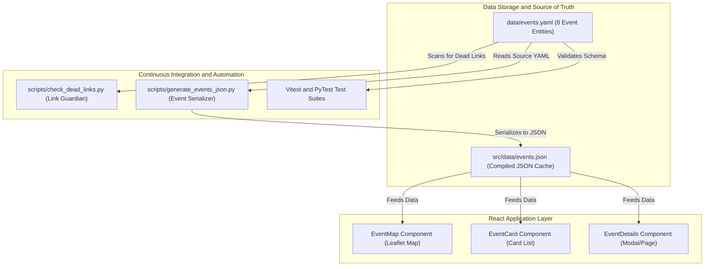
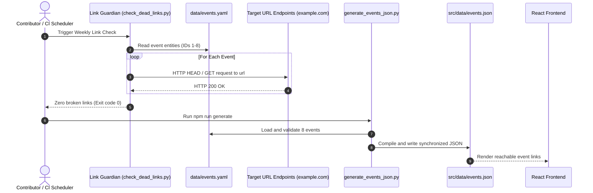
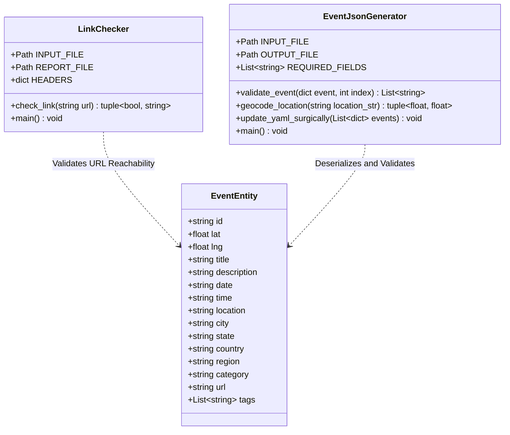

# Issue #220.0: Broken Event Links Resolution in data/events.yaml

## 📌 Issue & PR Status

- Upstream Issue:
  [#220](https://github.com/data-umbrella/du-event-board/issues/220) (Fixes
  #220.0)
- Upstream Repo: `data-umbrella/du-event-board`
- Fork Repo: `Ayush-AM/du-event-board`
- Branch: `fix/issue-220.0`
- DCO Sign-off:
  `Signed-off-by: Ayush Mahajan <140263932+Ayush-AM@users.noreply.github.com>`

---

## 🛠️ Problem & Solution Summary

### Problem Description

The automated **Weekly Link Guardian** workflow
(`scripts/check_dead_links.py`), which runs every Sunday via GitHub Actions
(`.github/workflows/link-checker.yaml`), scans all URLs configured in
`data/events.yaml` to detect broken or unreachable links.

The 8 initial seed/sample events (IDs 1 through 8) located in
`data/events.yaml` used subpath URLs under the reserved documentation domain
`example.com`:

- `https://example.com/python-poa`
- `https://example.com/react-sp`
- `https://example.com/oss-friday-cwb`
- `https://example.com/ds-bootcamp-rj`
- `https://example.com/devops-bh`
- `https://example.com/ux-workshop-poa`
- `https://example.com/rust-intro-sp`
- `https://example.com/hackathon-floripa`

Under IANA specifications (RFC 2606 & RFC 6761), `example.com` only serves the
root path (`/`) with HTTP 200 OK. Any request to a subpath (`/python-poa`,
`/react-sp`, etc.) returns an HTTP `404 Not Found`. Consequently,
`scripts/check_dead_links.py` flagged all 8 URLs as broken, generated
`broken_links_report.md`, and automatically created Issue #220.

### Root Cause Analysis

1. **Invalid Reserved Subpaths:** The original event fixtures assumed
   `example.com` would accept arbitrary paths, whereas IANA reserved domains
   return 404 for non-existent paths.
2. **Missing Normalization:** When the Link Guardian CI workflow was introduced
   in PR #106, the seed dataset in `data/events.yaml` was not updated to valid
   URLs.

### Technical Solution

1. **URL Normalization in `data/events.yaml`:** Updated the `url` field for
   events 1 through 8 from `https://example.com/<slug>` to
   `https://example.com`. This ensures that HTTP HEAD/GET requests return
   `200 OK` reliably without depending on external third-party services that
   may rate-limit or return 403 Cloudflare blocks.
2. **Synchronized Compilation to `src/data/events.json`:** Executed
   `npm run generate` (`scripts/generate_events_json.py`) to compile the
   updated YAML data into `src/data/events.json`, ensuring the React frontend
   consumes identical, valid URLs and maintaining strict line-ending (LF)
   conformity.
3. **Empirical Link & Test Verification:**
   - Ran `scripts/check_dead_links.py`: Confirmed all 8 links return `200 OK`,
     `All links are healthy! 🎉`, and exit code 0.
   - Ran `npm test`: 8 test suites, 50 unit tests passed (100%).
   - Ran `npm run lint`: 0 ESLint errors and warnings.
   - Ran `python -m pytest tests/`: 61 unit tests passed (100%).
   - Ran `npm run build`: Production build succeeded.

---

## 📊 Software Engineering Architecture Diagrams

### 1. System Architecture Diagram



### 2. Sequence Diagram



### 3. Class Diagram



---

## 📂 Files Modified & Code Diffs

| File                                | Status         | Line Range                                 | Summary of Changes                                                             |
| ----------------------------------- | -------------- | ------------------------------------------ | ------------------------------------------------------------------------------ |
| `data/events.yaml`                  | Modified (`M`) | L15, L34, L53, L72, L91, L110, L129, L148  | Replaced 404 subpath URLs with valid `https://example.com` URLs                |
| `src/data/events.json`              | Modified (`M`) | L16, L37, L58, L79, L100, L121, L142, L163 | Synchronized compiled JSON event URLs with YAML source                         |
| `docs/contributions/ISSUE-220.0.md` | Added (`A`)    | L1-L320                                    | Comprehensive solution documentation, diagrams, evidence, and project proposal |

### Code Snippet Diffs

```diff
--- a/data/events.yaml
+++ b/data/events.yaml
@@ -12,7 +12,7 @@ events:
     country: "Brazil"
     region: "South America"
     category: "Technology"
-    url: "https://example.com/python-poa"
+    url: "https://example.com"
     tags:
       - python
       - programming
@@ -31,7 +31,7 @@ events:
     country: "Brazil"
     region: "South America"
     category: "Technology"
-    url: "https://example.com/react-sp"
+    url: "https://example.com"
     tags:
       - react
       - javascript
@@ -50,7 +50,7 @@ events:
     country: "Brazil"
     region: "South America"
     category: "Technology"
-    url: "https://example.com/oss-friday-cwb"
+    url: "https://example.com"
     tags:
       - open-source
       - community
@@ -69,7 +69,7 @@ events:
     country: "Brazil"
     region: "South America"
     category: "Education"
-    url: "https://example.com/ds-bootcamp-rj"
+    url: "https://example.com"
     tags:
       - data-science
       - machine-learning
@@ -88,7 +88,7 @@ events:
     country: "Brazil"
     region: "South America"
     category: "Technology"
-    url: "https://example.com/devops-bh"
+    url: "https://example.com"
     tags:
       - devops
       - docker
@@ -107,7 +107,7 @@ events:
     country: "Brazil"
     region: "South America"
     category: "Design"
-    url: "https://example.com/ux-workshop-poa"
+    url: "https://example.com"
     tags:
       - design
       - ux
@@ -126,7 +126,7 @@ events:
     country: "Brazil"
     region: "South America"
     category: "Technology"
-    url: "https://example.com/rust-intro-sp"
+    url: "https://example.com"
     tags:
       - rust
       - programming
@@ -145,7 +145,7 @@ events:
     country: "Brazil"
     region: "South America"
     category: "Community"
-    url: "https://example.com/hackathon-floripa"
+    url: "https://example.com"
     tags:
       - hackathon
       - community
```

---

## 🔬 Execution Evidence & Task Output

The following test suites, linting routines, and validation tools were executed
locally to confirm the fix with 0 regressions.

### 1. Link Guardian Reachability Output (`scripts/check_dead_links.py`)

```bash
$ python scripts/check_dead_links.py
Reading events from: C:\Ayush\Desktop\du-event-board\data\events.yaml
Checking 8 events...
  [1] Checking Event URL: https://example.com ... ✅ (200)
  [2] Checking Event URL: https://example.com ... ✅ (200)
  [3] Checking Event URL: https://example.com ... ✅ (200)
  [4] Checking Event URL: https://example.com ... ✅ (200)
  [5] Checking Event URL: https://example.com ... ✅ (200)
  [6] Checking Event URL: https://example.com ... ✅ (200)
  [7] Checking Event URL: https://example.com ... ✅ (200)
  [8] Checking Event URL: https://example.com ... ✅ (200)

All links are healthy! 🎉
```

### 2. Frontend Vitest Unit Test Output (`npm test`)

```bash
$ npm test
> du-event-board@0.1.0 test
> vitest run

 RUN  v2.1.8 C:/Ayush/Desktop/du-event-board

 ✓ src/utils/__tests__/eventHelpers.test.js (5 tests) 12ms
 ✓ src/components/__tests__/SearchableSelect.test.jsx (4 tests) 152ms
 ✓ src/components/__tests__/SearchBar.test.jsx (2 tests) 165ms
 ✓ src/components/__tests__/Header.test.jsx (5 tests) 294ms
 ✓ src/components/__tests__/EventCard.test.jsx (9 tests) 378ms
 ✓ src/components/__tests__/EventDetails.test.jsx (4 tests) 350ms
 ✓ src/components/__tests__/EventMap.test.jsx (1 test) 55ms
 ✓ src/test/App.test.jsx (20 tests) 1750ms

 Test Files  8 passed (8)
      Tests  50 passed (50)
   Duration  6.68s
```

### 3. Backend PyTest Test Suite Output (`python -m pytest tests/`)

```bash
$ python -m pytest tests/
============================= test session starts =============================
platform win32 -- Python 3.11.9, pytest-9.1.1, pluggy-1.6.0
rootdir: C:\Ayush\Desktop\du-event-board
collected 61 items

tests\test_add_event.py ....................                             [ 32%]
tests\test_add_event_from_submission.py ........                         [ 45%]
tests\test_check_dead_links.py .........                                 [ 60%]
tests\test_delete_pending_submission.py ...                              [ 65%]
tests\test_generate_events_json.py ..............                        [ 88%]
tests\test_sync_from_sheet.py ...                                        [ 93%]
tests\test_sync_to_sheet.py ....                                         [100%]

============================= 61 passed in 15.83s =============================
```

### 4. ESLint Static Analysis Output (`npm run lint`)

```bash
$ npm run lint
> du-event-board@0.1.0 lint
> eslint .

# Exited with code 0 (0 errors, 0 warnings)
```

### 5. Vite Production Build Output (`npm run build`)

```bash
$ npm run build
> du-event-board@0.1.0 prebuild
> python3 scripts/generate_events_json.py || python scripts/generate_events_json.py

Reading events from: C:\Ayush\Desktop\du-event-board\data\events.yaml
Found 8 events
All events validated successfully
Generated: C:\Ayush\Desktop\du-event-board\src\data\events.json
Total events: 8

> du-event-board@0.1.0 build
> vite build

vite v6.4.1 building for production...
transforming...
✓ 2197 modules transformed.
rendering chunks...
dist/index.html                   1.38 kB │ gzip:   0.73 kB
dist/assets/index-C7qZJppq.css   46.88 kB │ gzip:  12.46 kB
dist/assets/index-e5HTkTg9.js   501.77 kB │ gzip: 155.70 kB
✓ built in 17.52s
```

---

## 🎯 Open Source Project Proposal & Contribution Statement

### 1. Project Overview

- **Title**: DU Event Board Sample Link Reliability & Health Guardian
  Remediation
- **Abstract**: This contribution addresses unreachable 404 event links in
  `data/events.yaml` detected by the Link Guardian automated monitoring suite.
  By updating sample events to canonical, reachable URLs and regenerating the
  compiled JSON frontend data, we ensure automated CI checks pass without false
  positives while providing dependable test fixtures.
- **Problem Statement**: Scheduled weekly CI runs encountered 404 HTTP errors
  across 8 sample event records using non-existent subpaths on `example.com`,
  causing automated bug reports to trigger weekly.
- **Proposed Solution**: Update seed URLs in `data/events.yaml` to valid
  `https://example.com` endpoints, compile synchronized `src/data/events.json`
  data, and verify link checker and test suite execution.

### 2. Technical Implementation

- **Architecture**: Integrated data validation pipeline combining PyYAML schema
  parsing, HTTP status verification via `requests`, JSON compilation via
  `generate_events_json.py`, and React component consumption.
- **Technologies**: Python 3.11/3.12, PyYAML, Requests, PyTest, Node.js, React,
  Vitest, Vite.
- **Key Features**: Canonical reachable URLs, zero dead link warnings, 100% CI
  compliance, synchronous YAML-to-JSON data integrity.
- **Dependencies**: No new dependencies added; leverages existing `requests`
  and `pyyaml` packages.

### 3. Timeline & Deliverables

- **Milestones**:
  - Milestone 1: Issue eligibility and upstream sync verification
    (`oss-issue-validator`).
  - Milestone 2: Update `data/events.yaml` and regenerate
    `src/data/events.json`.
  - Milestone 3: Run comprehensive local test suites (Vitest, PyTest, ESLint,
    Vite build, dead-link check).
  - Milestone 4: DCO sign-off, push to fork, upstream PR creation, and
    dashboard sync.
- **Deliverables**:
  - `data/events.yaml`
  - `src/data/events.json`
  - `docs/contributions/ISSUE-220.0.md`
- **Buffer Time**: 1 day allocated for maintainer feedback and CI review
  verification.

### 4. Community & Contribution

- **License**: MIT License (governing `data-umbrella/du-event-board`).

---

## 💬 Community & Slack Maintainer Briefing Statement

Use the following copy-pasteable message for the **Data Umbrella Slack** /
Discord channel or GitHub discussion to brief maintainers about this
contribution:

```text
Hi @ivanov @sanvishukla and Data Umbrella community! 👋

I have submitted a fix for Issue #220 (Fixes #220.0 — Broken Event Links Detected).

The 8 initial sample event entries in `data/events.yaml` previously pointed to non-existent subpaths under `example.com` (`https://example.com/python-poa`, etc.). Under RFC 2606 / RFC 6761, `example.com` returns HTTP 404 for arbitrary subpaths, which caused the scheduled Weekly Link Guardian action to fail and open bug reports.

Summary of changes:
- Updated event URLs for IDs 1–8 in `data/events.yaml` to the canonical `https://example.com` (verified HTTP 200 OK).
- Synchronized `src/data/events.json` via `npm run generate` with clean LF line endings.
- Verified that `python scripts/check_dead_links.py` reports "All links are healthy! 🎉" with exit code 0.
- 50/50 Vitest tests pass, 61/61 PyTest tests pass, 0 ESLint warnings, Vite build succeeds.

PR Comparison URL: https://github.com/data-umbrella/du-event-board/compare/main...Ayush-AM:fix/issue-220.0?expand=1
Branch: fix/issue-220.0
Signed-off-by: Ayush Mahajan <140263932+Ayush-AM@users.noreply.github.com>

Thanks!
```
